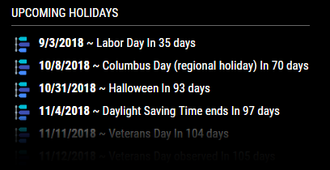
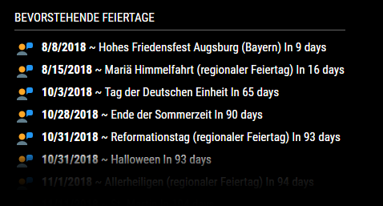

# MMM-Holidays2
Holiday 2 module for MagicMirror2

This is a MORE extensive list of holidays for countries and languages.

  

# INSTRUCTIONS
   
# ~MagicMirror/modules
 git clone https://github.com/cowboysdude/MMM-Holiday2
  
# ~MagicMirror/modules/MMM-Holidays2
 npm install
  

Before we get started on the config let me point out some options:

     Use header?  True or false [shows or hides header]
     Header?  What would you like it to say if you're using it?  true or false
     Country: Put your two letter country code here
     Lang:  put your two letter language here 
     days:  How many days in advance should it look for holidays?
     icon:  What font-awesome icon would you like to use?
     custom: use your own icon... True or font-awesome: false 
     img: Don't want font awesome icons...use your own!  There are many 
          in the icons dir but you can add your own!

# CONFIG

    {
            module: 'MMM-Holiday2',
            position: 'top_left',  //module position
            config: {
            	maxWidth: "375px",
                useHeader: true,  //use header true or false
                header: "Upcoming Holidays",
                country: "gr",  //country code
                lang: "el",  //language code
                days: '90'  //How many days in advance to show holidays for
                img: "person.png"  //what is the name of your custom icon file, needs to be located in icons dir? 
            }
        },

 # 2 Letter country and language code
   Many, but not ALL, have been tested.  Some may not work.
     
     [Here's some examples Country Language] - languages.txt file included in this repo
     
        Afghanistan	AF	ps
        Serbian	sr	srp	
        Czech Republic	cs-CZ
        Denmark	DK	da	
        United Kingdom	GB	cy
        United States	US	en
        United States	US es

   #CUSTOM CSS OPTIONS
   
Don't like the colors?  Change them!!  Here are some things you can change by putting them in your custom.css file!

      .MMM-Holiday2 .symbol {
	    color: #c9e4f5;
       }
      
The above only reference font-awesome icons!  They will NOT work for your custom icons....     
       
Use these to change the color of your holidays listing..  the 1st one is for if there is a holidays you can change the txt color to stand out]

        .MMM-Holiday2 .today {
	     color: #54d2e4;
        }
        
 What color do you want the text in a NON holiday day?  I stick with white myself :)
 
        .MMM-Holiday2 .holiday {
	     color: #fff;
        }
